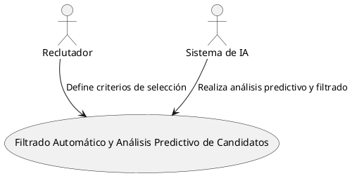
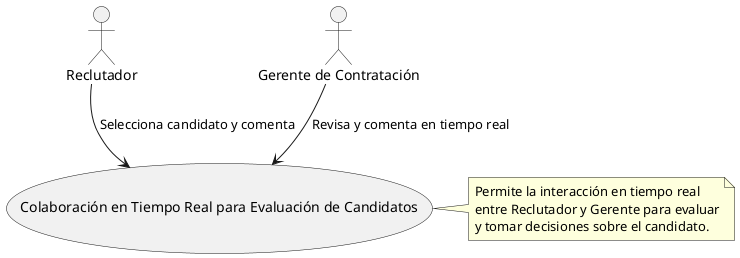
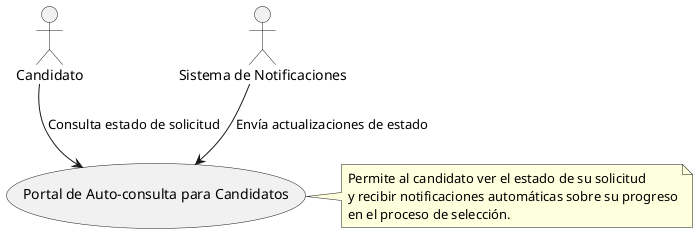
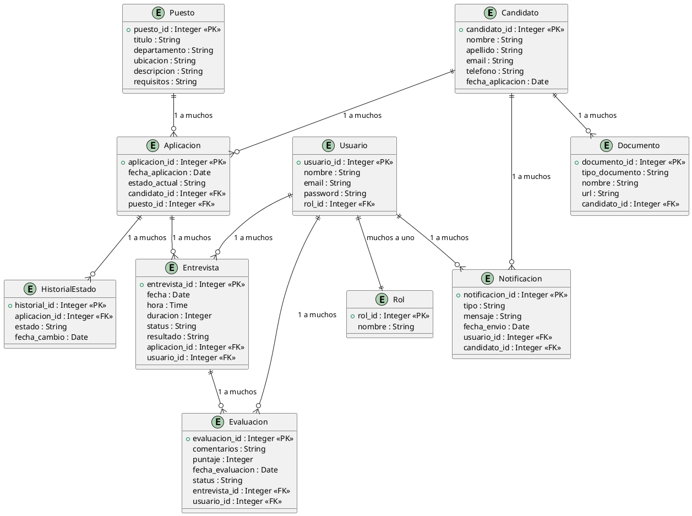
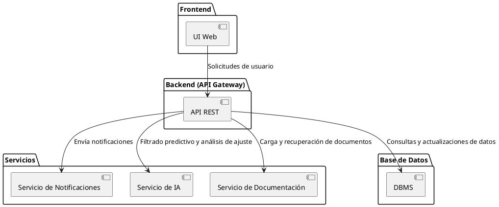
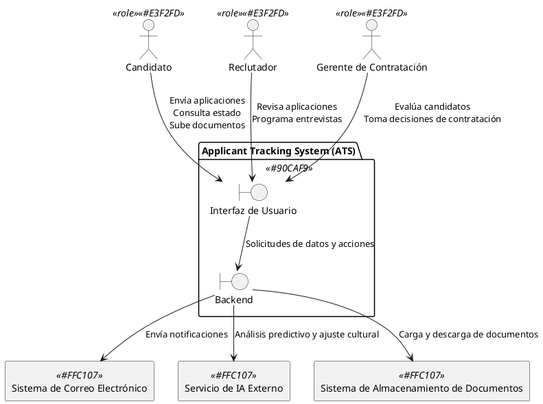
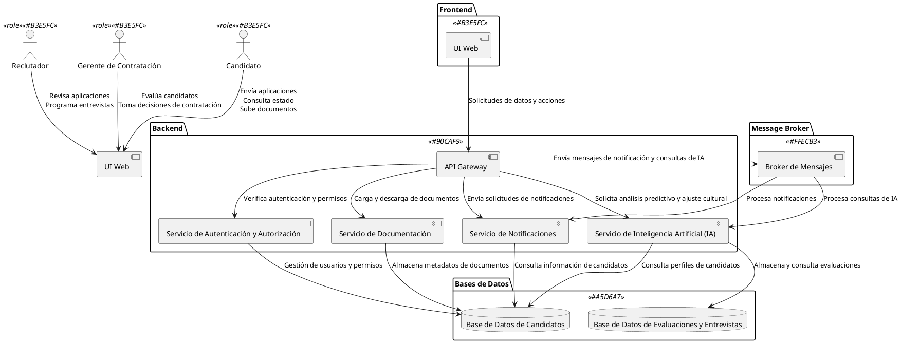
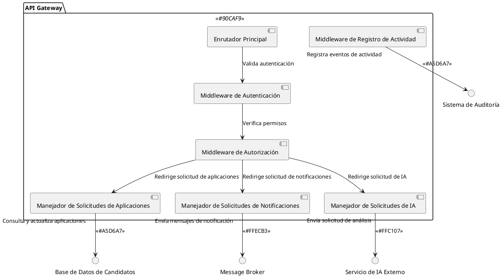

# ATS LTI

## Descripción del Software LTI ATS

**LTI ATS** es un sistema de gestión de candidatos (Applicant-Tracking System) diseñado por LTI, una startup innovadora que busca crear el "ATS del futuro". El software de LTI se diferencia por su enfoque en la automatización avanzada, el uso de inteligencia artificial (IA) en el proceso de selección y la creación de una plataforma altamente colaborativa para los departamentos de Recursos Humanos (HR). Este ATS optimiza el flujo de contratación al mejorar la eficiencia, facilitando una colaboración en tiempo real entre reclutadores y gerentes, y ofreciendo herramientas avanzadas de análisis y predicción para tomar decisiones informadas en cada etapa del proceso de selección.

### Valor Añadido y Ventajas Competitivas

1. **Recursos Humanos**:
   - **Eficiencia y Reducción de Tareas Manuales**: A través de la automatización de tareas repetitivas como el envío de correos electrónicos y la actualización de estados de candidatos, LTI ATS libera tiempo para que los profesionales de HR se concentren en tareas de alto valor, como la evaluación y selección de talento de calidad.
   - **Colaboración en Tiempo Real**: La herramienta permite a los reclutadores y gerentes de contratación trabajar de manera coordinada en una interfaz compartida, con actualizaciones y comentarios en tiempo real, lo que acelera el proceso de toma de decisiones.

2. **Tecnología**:
   - **Inteligencia Artificial Avanzada**: LTI ATS utiliza IA para realizar filtrado y análisis predictivo de candidatos, ayudando a identificar los perfiles con mayor potencial de éxito en la empresa. Esta IA permite realizar un análisis predictivo de ajuste cultural y de desempeño, anticipando así la compatibilidad del candidato a largo plazo.
   - **Automatización Completa**: La integración de tecnologías de automatización avanzada permite gestionar tareas administrativas y repetitivas, optimizando el tiempo y la eficiencia del proceso de selección en cada etapa.

3. **UX/UI**:
   - **Portal de Candidatos Optimizado**: LTI ATS ofrece a los candidatos un portal de auto-consulta donde pueden monitorear el estado de sus aplicaciones y recibir actualizaciones en tiempo real, mejorando la transparencia y la satisfacción en el proceso de selección.
   - **Experiencia de Usuario para Reclutadores y Gerentes**: El diseño de la interfaz de usuario es intuitivo, accesible y pensado para facilitar la colaboración. Los usuarios pueden ver información relevante, realizar filtros avanzados y trabajar de manera fluida en una plataforma adaptativa y fácil de navegar.

4. **Análisis de Negocios**:
   - **Ventaja Competitiva en el Mercado**: A diferencia de los sistemas de seguimiento de candidatos tradicionales, LTI ATS no solo se enfoca en el seguimiento básico, sino que agrega valor mediante análisis predictivo, automatización y una interfaz colaborativa en tiempo real. Esta propuesta mejora tanto la eficiencia del proceso de contratación como la calidad de las decisiones de selección de talento.
   - **Adaptabilidad y Escalabilidad**: LTI ATS está diseñado para adaptarse a diferentes necesidades y tamaños de empresas, desde startups hasta grandes corporaciones, ofreciendo un sistema escalable que puede expandirse conforme la empresa crece y requiere funcionalidades adicionales.

### Explicación de las Funciones Principales

- **Filtrado y Análisis Inteligente de Candidatos**: El ATS filtra automáticamente aplicaciones según criterios personalizados, usa IA para identificar perfiles potenciales y crea evaluaciones predictivas para determinar la adecuación del candidato a la empresa.
  
- **Gestión y Retroalimentación en Tiempo Real**: Un panel compartido permite a los reclutadores y gerentes realizar evaluaciones y comentarios sobre los candidatos, creando un flujo de comunicación transparente y eficiente.
  
- **Panel Colaborativo Adaptativo**: El sistema permite ver el progreso de los candidatos, compartir notas, y tomar decisiones en equipo, mejorando la comunicación y colaboración en tiempo real.
  
- **Automatización de Tareas Repetitivas**: Automáticamente envía correos, organiza entrevistas y actualiza estados de candidatos, eliminando procesos manuales y ahorrando tiempo a los equipos de HR.
  
- **Portal de Auto-consulta para Candidatos**: Un espacio donde los candidatos pueden verificar el estado de sus aplicaciones y hacer preguntas, lo cual mejora la transparencia y la experiencia general del usuario.
  
- **Dashboard Analítico con IA Integrada**: El dashboard ofrece métricas personalizables para los gerentes, con informes detallados y predicciones sobre los candidatos para tomar decisiones informadas y aumentar la efectividad del proceso de contratación.

### Funcionalidades Clave de LTI ATS desde la Perspectiva de Recursos Humanos

**LTI ATS** ofrece funcionalidades diseñadas para optimizar los procesos de selección y contratación, con un enfoque en la eficiencia, colaboración y automatización que facilita el trabajo de los equipos de Recursos Humanos. A continuación se detallan las funcionalidades clave que convierten a LTI ATS en una herramienta indispensable para los departamentos de HR:

1. **Automatización de Tareas Repetitivas**
   - **Gestión Automatizada de Correos Electrónicos**: El sistema permite enviar automáticamente correos personalizados a los candidatos en cada etapa del proceso de selección. Esto asegura una comunicación constante y profesional sin necesidad de intervención manual.
   - **Actualización de Estado de los Candidatos**: LTI ATS actualiza de manera automática el estado de cada candidato conforme avanzan en el proceso, eliminando la necesidad de que los reclutadores realicen esta tarea de forma manual.
   - **Recordatorios y Notificaciones**: Para evitar demoras y mejorar la eficiencia, el sistema envía notificaciones automáticas a los reclutadores y gerentes sobre próximas entrevistas, fechas límite de retroalimentación y otros hitos críticos.

2. **Herramientas de Colaboración en Tiempo Real**
   - **Interfaz de Colaboración para Reclutadores y Gerentes**: LTI ATS proporciona un espacio colaborativo donde los reclutadores y gerentes de contratación pueden trabajar de manera conjunta, intercambiar comentarios, calificar candidatos y tomar decisiones en tiempo real.
   - **Comentarios y Evaluaciones Compartidos**: Cada miembro del equipo de contratación puede agregar sus observaciones sobre los candidatos, las cuales son visibles para todo el equipo, permitiendo una retroalimentación continua y transparente.
   - **Notificaciones de Actualizaciones en Tiempo Real**: Las notificaciones instantáneas permiten que todos los miembros del equipo estén al tanto de los cambios y decisiones de otros usuarios, optimizando el flujo de trabajo colaborativo.

3. **Experiencia de Usuario para los Candidatos**
   - **Portal de Auto-consulta**: LTI ATS ofrece a los candidatos un portal donde pueden consultar en cualquier momento el estado de su aplicación y recibir retroalimentación en tiempo real sobre su progreso. Esto no solo mejora la experiencia del candidato, sino que también reduce la carga de consultas directas a los reclutadores.
   - **Preguntas y Respuestas en Tiempo Real**: Los candidatos tienen la opción de enviar preguntas o consultas a los reclutadores, lo que fomenta una comunicación más fluida y personalizada durante el proceso de selección.

4. **Análisis de Eficiencia y Optimización del Proceso de Selección**
   - **Reportes Personalizables para Equipos de RRHH**: LTI ATS permite generar reportes detallados y personalizados que muestran KPIs relevantes, como el tiempo promedio de contratación, tasa de entrevistas efectivas y retención de candidatos. Estos reportes ayudan a los departamentos de HR a medir y optimizar su rendimiento.
   - **Predicción de Ajuste Cultural y Éxito de los Candidatos**: A través de IA, el sistema analiza datos históricos y de perfil de los candidatos para predecir la compatibilidad cultural y el éxito potencial, facilitando decisiones más informadas.

### Funcionalidades Clave de LTI ATS desde la Perspectiva de Tecnología

Desde un enfoque tecnológico, **LTI ATS** se distingue por su avanzada infraestructura de inteligencia artificial, automatización de procesos y un diseño escalable que permite una colaboración en tiempo real. Estas son las funcionalidades tecnológicas clave que diferencian a LTI ATS de los sistemas tradicionales de seguimiento de candidatos:

1. **Inteligencia Artificial para Filtrado y Análisis Predictivo**
   - **Filtrado Avanzado de Candidatos**: LTI ATS emplea algoritmos de IA para analizar los perfiles de los candidatos de manera exhaustiva, filtrando automáticamente las aplicaciones según criterios personalizados de habilidades, experiencia y competencias, acelerando así la identificación de candidatos potenciales.
   - **Análisis Predictivo de Ajuste y Éxito del Candidato**: A través de modelos de machine learning, el sistema predice la compatibilidad cultural de los candidatos y su potencial de éxito en la organización. Esta funcionalidad ayuda a los equipos de RRHH a tomar decisiones más estratégicas y personalizadas en el proceso de selección.
   - **Procesamiento de Lenguaje Natural (NLP)**: Mediante NLP, el ATS analiza descripciones de trabajos y currículums, identificando palabras clave y habilidades relevantes, lo que optimiza el proceso de coincidencia entre candidato y posición.

2. **Automatización de Procesos para Optimización de Tareas**
   - **Automatización de Correos y Comunicaciones**: LTI ATS automatiza el envío de correos electrónicos personalizados en cada etapa del proceso de selección, permitiendo una comunicación constante y profesional con los candidatos sin intervención manual.
   - **Programación de Entrevistas y Recordatorios Automáticos**: El sistema integra la programación automatizada de entrevistas en función de la disponibilidad de los reclutadores y candidatos, y envía recordatorios automáticos para asegurar que no se omitan citas o tareas importantes.
   - **Actualización y Seguimiento en Tiempo Real**: Cada cambio en el proceso de selección se actualiza de forma instantánea, lo que permite a todos los usuarios estar informados y alineados en tiempo real.

3. **Infraestructura de Colaboración y Escalabilidad**
   - **Plataforma de Colaboración en Tiempo Real**: Diseñada para facilitar la comunicación y colaboración entre los equipos de contratación, la plataforma de LTI ATS permite a los reclutadores y gerentes trabajar de forma conjunta en una interfaz interactiva. Los comentarios y decisiones de cada miembro del equipo se actualizan en tiempo real.
   - **Escalabilidad y Modularidad**: La arquitectura de LTI ATS está construida sobre un diseño modular y escalable que permite añadir nuevas funcionalidades y expandir capacidades conforme las necesidades de la empresa crecen. La infraestructura soporta microservicios, lo que facilita el mantenimiento y la integración de futuras tecnologías.
   - **Integraciones API para Sistemas Externos**: LTI ATS está preparado para integrarse fácilmente con otras herramientas y plataformas de recursos humanos mediante APIs seguras, como sistemas de gestión de empleados, plataformas de gestión de talento y herramientas de comunicación interna.

4. **Seguridad y Cumplimiento Normativo**
   - **Cumplimiento de GDPR y Normativas de Privacidad**: LTI ATS asegura el cumplimiento de las regulaciones de protección de datos (GDPR y otras), gestionando de forma segura los datos de candidatos y manteniendo la privacidad de la información.
   - **Autenticación y Control de Acceso Avanzado**: El sistema incluye autenticación de múltiples factores y control de acceso basado en roles, lo que asegura que solo los usuarios autorizados puedan acceder a información sensible.

### Funcionalidades Clave de LTI ATS desde la Perspectiva de UX/UI

**LTI ATS** se distingue por su enfoque en la experiencia de usuario (UX) y la interfaz de usuario (UI), optimizando la interacción tanto para los candidatos como para los equipos de Recursos Humanos. El diseño intuitivo, accesible y colaborativo de la plataforma permite que los usuarios naveguen y realicen tareas de manera eficiente, mejorando así la efectividad del proceso de contratación. A continuación, se detallan las funcionalidades clave desde la perspectiva de UX/UI:

1. **Portal de Candidatos Optimizado**
   - **Acceso Transparente a la Información del Proceso de Selección**: LTI ATS ofrece un portal de auto-consulta donde los candidatos pueden ver el estado de su aplicación en tiempo real, recibir actualizaciones automáticas y acceder a detalles de cada etapa del proceso.
   - **Interacción en Tiempo Real**: A través de un sistema de chat o mensajería, los candidatos pueden hacer preguntas y recibir respuestas de los reclutadores, mejorando la transparencia y la comunicación durante el proceso de selección.
   - **Diseño Orientado a la Satisfacción del Usuario**: La interfaz del portal de candidatos está diseñada para ser visualmente atractiva, fácil de navegar y amigable en dispositivos móviles, asegurando que todos los usuarios tengan una experiencia de aplicación intuitiva y sin fricciones.

2. **Interfaz de Usuario para Reclutadores y Gerentes de Contratación**
   - **Panel de Control Personalizado**: El sistema proporciona a los reclutadores y gerentes un panel personalizable con toda la información relevante a la vista. Esto incluye el estado de los candidatos, próximas entrevistas y evaluaciones en curso, permitiendo acceder rápidamente a datos clave sin la necesidad de búsquedas extensivas.
   - **Herramientas de Colaboración Interactiva**: El diseño del sistema facilita la colaboración en tiempo real entre los miembros del equipo de contratación, permitiendo agregar comentarios, calificaciones y etiquetas a los perfiles de candidatos. Esta funcionalidad crea un espacio compartido y accesible para la toma de decisiones en equipo.
   - **Flujo de Trabajo Visual**: La interfaz emplea un diseño visual que permite a los usuarios ver el flujo completo del proceso de selección en una vista tipo “pipeline” o "kanban", facilitando la gestión de cada fase del proceso de contratación de un vistazo.

3. **Mejores Prácticas de Diseño UX/UI**
   - **Diseño Centrado en el Usuario**: Todo el sistema de LTI ATS ha sido diseñado con un enfoque de experiencia de usuario centrada, asegurando que los flujos de trabajo de candidatos y reclutadores sean intuitivos, rápidos y alineados con sus necesidades y objetivos.
   - **Facilidad de Navegación y Accesibilidad**: La interfaz de LTI ATS es limpia, con una jerarquía visual clara y accesibilidad en diferentes dispositivos, cumpliendo con estándares de accesibilidad para usuarios con discapacidades y garantizando una experiencia inclusiva.
   - **Notificaciones e Interactividad en Tiempo Real**: El diseño incluye notificaciones en tiempo real y elementos interactivos que permiten a los usuarios actualizar información y colaborar sin necesidad de recargar la página, asegurando una experiencia ágil y sin interrupciones.

4. **Personalización y Configurabilidad**
   - **Ajustes de Interfaz Personalizables**: Los usuarios pueden personalizar la disposición de sus paneles y configurar notificaciones según sus preferencias, lo que permite adaptar la plataforma a sus flujos de trabajo individuales.
   - **Modo Oscuro y Ajustes de Visualización**: Para mejorar la usabilidad y reducir la fatiga visual, LTI ATS ofrece modos de visualización configurables, incluyendo modo oscuro y ajustes de tamaño de texto, ofreciendo así una experiencia adaptable a las preferencias del usuario.

---

## Lean Canvas para LTI ATS

| **Bloque**              | **Descripción Detallada**                                                                                                                                                                                                                                         |
|-------------------------|---------------------------------------------------------------------------------------------------------------------------------------------------------------------------------------------------------------------------------------------------------------------|
| **Problema**            | LTI ATS resuelve la falta de eficiencia en los procesos de contratación, un desafío central para los departamentos de Recursos Humanos en empresas de diversos tamaños. Este problema se descompone en tres desafíos principales: - **Carga Manual de Tareas**: Los procesos de contratación convencionales requieren mucho tiempo debido a tareas repetitivas, como la clasificación de currículos, el envío de correos electrónicos y la actualización del estado de los candidatos. Estos procedimientos generan una carga significativa para los equipos de RRHH. - **Colaboración Ineficiente**: La falta de herramientas efectivas de colaboración en tiempo real limita la comunicación y coordinación entre reclutadores, gerentes de contratación y otras partes interesadas, lo que retrasa la toma de decisiones y el progreso de los candidatos. - **Experiencia Limitada para el Candidato**: La falta de transparencia y comunicación en el proceso de contratación afecta negativamente la percepción de los candidatos, lo cual puede desmotivar a talentos potenciales y afectar la reputación de la empresa. |
| **Segmento de Clientes**| LTI ATS está diseñado principalmente para **empresas y departamentos de Recursos Humanos** en sectores como tecnología, servicios financieros, manufactura y organizaciones en rápido crecimiento. - **Demografía**: Empresas de tamaño medio a grande, que manejan un alto volumen de contratación y necesitan optimizar sus procesos de selección. - **Geografía**: Empresas con operaciones globales y locales que requieren herramientas que se adapten a diferentes normativas y prácticas de contratación. - **Psicografía**: Equipos de Recursos Humanos que buscan mejorar la eficiencia mediante tecnología avanzada y procesos optimizados. - **Comportamientos**: Este segmento de clientes prioriza soluciones tecnológicas que permitan la colaboración y automatización en la gestión de candidatos. Otro segmento relevante incluye **candidatos** que interactúan con el portal, buscando transparencia y actualización en el proceso de selección. |
| **Propuesta de Valor Única** | **"Automatización avanzada y análisis predictivo para un reclutamiento eficiente y colaborativo."** LTI ATS se diferencia por su enfoque en IA y automatización para reducir el tiempo de contratación y optimizar la experiencia tanto para candidatos como para equipos de Recursos Humanos. Los principales beneficios incluyen: - **Reducción significativa en el tiempo y esfuerzo de tareas manuales**: A través de la automatización de tareas repetitivas y la IA para filtrado inteligente. - **Colaboración en tiempo real**: Proporciona un espacio de trabajo en el que reclutadores y gerentes pueden interactuar y tomar decisiones de forma rápida y coordinada. - **Experiencia del candidato optimizada**: Ofrece a los candidatos un portal donde pueden monitorear el estado de su postulación en tiempo real, lo que mejora la transparencia y la satisfacción en el proceso de selección. |
| **Solución**            | LTI ATS resuelve los problemas de los procesos de contratación mediante las siguientes funcionalidades clave: - **IA para Filtrado Predictivo y Análisis de Ajuste Cultural**: Identifica candidatos que mejor se adaptan a la organización, proporcionando un análisis predictivo de ajuste y retención potencial. - **Automatización de Tareas Repetitivas**: Automatiza el envío de correos electrónicos, la programación de entrevistas y la actualización del estado de los candidatos, reduciendo la carga de tareas manuales en un 30-50%. - **Panel de Colaboración en Tiempo Real**: Facilita la comunicación entre reclutadores y gerentes de contratación con comentarios y evaluaciones en tiempo real. - **Portal de Auto-consulta para Candidatos**: Brinda transparencia y accesibilidad a los candidatos, mejorando la experiencia y aumentando la retención de talento. |
| **Canales**             | LTI ATS utiliza una combinación de canales para captar y retener clientes: - **Marketing Digital**: A través de publicidad en redes sociales, marketing de contenido y campañas en LinkedIn, dirigidas a profesionales de RRHH. - **Eventos de HRTech y Ferias Tecnológicas**: Participación en ferias y eventos de Recursos Humanos para aumentar la visibilidad y conectar directamente con líderes de RRHH. - **Demostraciones y Webinars**: Ofrecemos presentaciones y sesiones de demostración para mostrar las funcionalidades avanzadas del sistema a potenciales clientes. - **Parcerias Estratégicas**: Alianzas con empresas de consultoría y plataformas de recursos humanos para aumentar la presencia en el mercado. |
| **Flujo de Ingresos**   | LTI ATS genera ingresos a través de: - **Modelo de Suscripción Premium**: Incluye diferentes niveles de suscripción para funcionalidades básicas, avanzadas y personalizadas, ajustándose a las necesidades de diferentes clientes. - **Servicios Adicionales de IA y Personalización**: Servicios adicionales como optimización de perfiles de candidatos y análisis predictivo de ajuste cultural generarán ingresos complementarios. - **Consultoría y Formación**: Se ofrecen servicios de formación y soporte para empresas que necesiten capacitación en el uso de la IA y las herramientas avanzadas del ATS. Este flujo de ingresos ayuda a consolidar la relación con el cliente y facilita la adopción de nuevas funcionalidades. |
| **Estructura de Costos**| Los principales costos de LTI ATS incluyen: - **Desarrollo y Mantenimiento de IA**: Inversión en algoritmos avanzados y optimización continua del sistema de IA para garantizar precisión y efectividad. - **Infraestructura de Servidor y Almacenamiento en la Nube**: Costos asociados con el almacenamiento seguro de datos y la escalabilidad del sistema. - **Marketing y Ventas**: Gastos en campañas publicitarias y equipo de ventas para aumentar la captación de clientes. - **Soporte y Capacitación**: Costos de personal dedicado a soporte técnico y capacitación para usuarios nuevos. - **Cumplimiento de Regulaciones**: Inversiones en seguridad y privacidad para asegurar el cumplimiento de normativas de protección de datos (GDPR y otras). |
| **Métricas Clave**      | Las métricas principales para evaluar el éxito de LTI ATS incluyen: - **Tasa de Conversión de Candidatos**: Mide la efectividad de la herramienta en la selección de candidatos adecuados. - **Tiempo Promedio de Contratación**: Evalúa la reducción en el tiempo de contratación mediante la automatización y la IA. - **Satisfacción del Candidato y del Cliente**: A través de encuestas y retroalimentación para medir la experiencia de uso tanto para candidatos como para usuarios de RRHH. - **Costos de Adquisición de Clientes (CAC)**: Ayuda a evaluar la efectividad de los canales de marketing y el retorno sobre la inversión (ROI). - **Valor de Vida del Cliente (LTV)**: Permite identificar la rentabilidad y fidelización de los clientes a largo plazo. |
| **Ventaja Competitiva Injusta** | LTI ATS cuenta con ventajas competitivas difíciles de replicar, como: - **Algoritmos de IA Propietarios**: La tecnología de análisis predictivo y filtrado avanzado de candidatos basada en IA ofrece una ventaja única y avanzada en el mercado. - **Integración API con Plataformas de RRHH**: Ofrece una conectividad sin fricciones con otras herramientas y plataformas de RRHH, fortaleciendo su funcionalidad en ecosistemas ya establecidos. - **Red de Socios Exclusivos**: Alianzas estratégicas con empresas de consultoría y tecnología de RRHH que facilitan la integración en diversos sectores y ofrecen respaldo adicional para el crecimiento y la adopción de la herramienta en el mercado. |

---

## Visión Estratégica a Largo Plazo para el Negocio

### Visión a 10 Años

En 10 años, **LTI ATS** será una referencia mundial en tecnología de gestión de talento y contratación. Se consolidará como el líder en **Applicant-Tracking Systems (ATS)** avanzados, con una participación significativa en los mercados de recursos humanos y tecnología. LTI ATS se habrá transformado en una plataforma integral de selección de talento basada en inteligencia artificial, accesible y adaptable, sirviendo a empresas de todos los tamaños en sectores globales como tecnología, finanzas, salud y manufactura.

LTI ATS será percibido como el socio ideal para empresas que buscan optimizar su proceso de contratación, ofreciendo no solo una plataforma de gestión, sino también asesoramiento estratégico y soporte continuo en eficiencia de recursos humanos. Los clientes lo verán como una solución integral, innovadora y personalizada, valorada tanto por sus resultados como por su impacto positivo en diversidad e inclusión. Los empleados lo verán como una empresa que prioriza el crecimiento profesional, la innovación y el impacto social, mientras que la sociedad reconocerá a LTI ATS como un promotor de mejores prácticas en la contratación y el desarrollo de talento.

### Objetivos Estratégicos Clave

1. **Expansión de Mercado Global**: Expandir la presencia de LTI ATS en los principales mercados de RRHH y tecnología de todo el mundo, adaptándose a las normativas y culturas locales. Esto incluirá una estrategia de entrada a los mercados emergentes de alto crecimiento en Asia, América Latina y África.

2. **Innovación en Inteligencia Artificial y Automatización**: Desarrollar tecnologías avanzadas de IA para mejorar continuamente el análisis predictivo, el ajuste cultural, y la evaluación de talento. Este objetivo incluye mantener el ATS actualizado con capacidades de aprendizaje automático, IA explicativa y análisis de diversidad en tiempo real.

3. **Excelencia en Experiencia del Cliente y Relación a Largo Plazo**: Convertirse en el proveedor preferido de soluciones de gestión de talento mediante la excelencia en servicio al cliente y la personalización de funcionalidades. LTI ATS buscará establecer relaciones de largo plazo con clientes mediante un enfoque en soluciones integrales, soporte dedicado y consultoría.

4. **Fortalecimiento de la Sostenibilidad y la Diversidad**: Crear un impacto positivo en diversidad, inclusión y sostenibilidad, desarrollando prácticas y herramientas que ayuden a las empresas a mejorar sus procesos de contratación equitativos y sostenibles. Esto incluye un compromiso con la igualdad de oportunidades en la selección de talento.

5. **Optimización de la Infraestructura y Escalabilidad Técnica**: Construir una infraestructura escalable y adaptable que permita integrar nuevas tecnologías, servicios y funcionalidades a medida que evoluciona el mercado. Este objetivo garantiza la flexibilidad para implementar actualizaciones y expansiones de manera eficiente.

### Factores de Escalabilidad

1. **Operaciones**:
   - **Optimización de Procesos**: Implementar procesos estandarizados y eficientes, con metodologías como Lean y Six Sigma, para minimizar tiempos y costos. A medida que el negocio crece, se optimizará cada etapa del ciclo de desarrollo y atención al cliente.
   - **Tecnología Clave**: Desarrollar una infraestructura en la nube que soporte el crecimiento de usuarios, manteniendo la capacidad de procesamiento y seguridad de datos.
   - **Estructura Organizativa**: Adoptar una estructura organizativa flexible y descentralizada que permita adaptarse rápidamente a los cambios. Esto incluye equipos de trabajo autónomos con especialización en IA, análisis de talento y soporte al cliente.

2. **Marketing y Ventas**:
   - **Canales de Marketing Digital y CRM**: Utilizar marketing digital en redes sociales y motores de búsqueda, apoyado por sistemas CRM avanzados que capturen y gestionen clientes potenciales de manera eficiente.
   - **Expansión de Socios y Alianzas**: Establecer alianzas estratégicas con plataformas de recursos humanos, consultoras y asociaciones de la industria, expandiendo el alcance de LTI ATS.
   - **Fidelización de Clientes**: Implementar programas de fidelización y servicios de valor añadido que mejoren la retención de clientes a largo plazo, como acceso exclusivo a innovaciones y servicios de consultoría.

3. **Finanzas**:
   - **Reinversión Estratégica de Ingresos**: Reinvertir los ingresos en desarrollo de producto, infraestructura tecnológica y adquisición de talento. Este modelo asegura que los beneficios se destinen a mejorar el producto y la experiencia del cliente.
   - **Estrategias de Financiamiento**: Explorar opciones de financiamiento como capital de riesgo en etapas iniciales y la emisión de bonos a largo plazo, permitiendo una expansión sostenida y el financiamiento de innovaciones tecnológicas.
   - **Optimización de Estructura de Costos**: Mantener un equilibrio entre costos fijos y variables para maximizar la eficiencia financiera. Esto incluye la automatización de procesos para reducir costos operativos.

4. **Tecnología**:
   - **Plataforma en la Nube y APIs Abiertas**: Basar la plataforma en una infraestructura de nube escalable y una arquitectura de API abierta, que permita integraciones fáciles con sistemas externos y soportar un crecimiento exponencial.
   - **Automatización de Infraestructura (DevOps)**: Implementar DevOps y tecnologías de infraestructura como código (IaC) para gestionar, desplegar y escalar servicios de manera ágil y automática.
   - **Seguridad y Cumplimiento**: Priorizar la seguridad y cumplimiento de normativas internacionales como GDPR, desarrollando protocolos avanzados de protección de datos y controles de acceso.

### Principios y Métricas de Escalabilidad

1. **Crecimiento de Ingresos Anual (CAGR)**: Supervisar el crecimiento de ingresos para asegurar una tasa de crecimiento anual compuesta sostenida.
2. **Valor de Tiempo de Vida del Cliente (LTV)**: Medir el valor de tiempo de vida del cliente para optimizar la rentabilidad y personalización de los servicios.
3. **Rentabilidad y Optimización de Costos**: Evaluar el margen de beneficio operativo y buscar la optimización de costos en áreas clave mediante la automatización.
4. **Costos de Adquisición de Clientes (CAC)**: Supervisar los CAC y buscar estrategias que maximicen la relación LTV/CAC para asegurar una rentabilidad sostenible a largo plazo.

### Evaluación de Riesgos y Oportunidades

1. **Riesgos Principales**:
   - **Cambios Regulatorios**: Las normativas de privacidad de datos y empleo podrían aumentar los costos de cumplimiento y limitar el acceso a ciertos mercados.
   - **Competencia en Tecnologías Emergentes**: La rápida evolución de la IA y la aparición de competidores que desarrollen ATS avanzados podría representar una amenaza para LTI ATS.
   - **Escalabilidad Técnica y Complejidad**: El crecimiento rápido en clientes podría sobrecargar la infraestructura si no se optimizan las operaciones y tecnología a tiempo.

2. **Oportunidades**:
   - **Expansión Global en Mercados Emergentes**: Los mercados emergentes en Asia, América Latina y África ofrecen una demanda creciente para herramientas avanzadas de RRHH.
   - **Integración con Otras Plataformas de Recursos Humanos**: LTI ATS puede posicionarse como el socio preferido para integrar servicios de selección de talento en plataformas ya consolidadas.
   - **Desarrollo de IA Explicativa y Transparente**: Al ser pioneros en la IA explicativa, LTI ATS puede ganar credibilidad y diferenciarse mediante IA ética y transparente en la selección de talento.

### Sostenibilidad y Adaptabilidad

1. **Sostenibilidad Empresarial y Social**:
   - Desarrollar herramientas que faciliten la diversidad y sostenibilidad en las empresas de los clientes, apoyando prácticas de contratación equitativas y responsables.
   - Implementar políticas internas que promuevan la sostenibilidad y la responsabilidad social, como reducir el uso de recursos y adoptar energías limpias en la infraestructura tecnológica.

2. **Adaptabilidad ante Cambios del Mercado**:
   - Mantener equipos de innovación y vigilancia tecnológica que identifiquen oportunidades de mejora continua, incorporando nuevas tendencias y tecnologías emergentes.
   - Desarrollar una cultura organizativa que fomente la innovación y la agilidad, permitiendo a LTI ATS adaptarse sin perder su visión y valores fundamentales.

### Ejemplos de Modelos Exitosos

1. **Salesforce**: Su éxito en escalabilidad radica en la infraestructura en la nube y una estrategia de APIs abiertas que permite integraciones y expansiones continuas. LTI ATS puede adoptar una arquitectura similar para expandir funcionalidades y mantener una plataforma adaptable.
2. **LinkedIn**: LinkedIn ha logrado una presencia global combinando la innovación en inteligencia artificial para recomendaciones personalizadas y un fuerte enfoque en la experiencia del usuario. LTI ATS puede aplicar estas estrategias de IA y UX para mejorar la retención y satisfacción del cliente.
3. **Workday**: Su enfoque en HRTech y finanzas le ha permitido crecer mediante soluciones integrales y personalizables para grandes corporaciones. Inspirarse en su modelo permite a LTI ATS crear soluciones escalables que atiendan tanto a empresas medianas como a grandes corporaciones.

---

## Analisis de Casos de Uso de LTI ATS

### Análisis de los 10 Casos de Uso Más Relevantes para LTI ATS

| #  | Nombre del Caso de Uso                                | Descripción                                                                                                                                                                                                     | Actores Involucrados                                                    | Relevancia                                                                                     |
|----|-------------------------------------------------------|-----------------------------------------------------------------------------------------------------------------------------------------------------------------------------------------------------------------|-------------------------------------------------------------------------|------------------------------------------------------------------------------------------------|
| 1  | Filtrado Automático y Análisis Predictivo de Candidatos | Permite al sistema filtrar automáticamente aplicaciones según criterios definidos y realizar análisis predictivo de ajuste cultural y éxito. Esto ayuda a identificar candidatos adecuados de forma eficiente. | Reclutador (define criterios y revisa resultados), Sistema de IA        | Alta. Mejora la eficiencia del proceso de contratación, reduciendo tiempos y optimizando la selección. |
| 2  | Colaboración en Tiempo Real entre Reclutador y Gerente de Contratación | Facilita la colaboración en tiempo real entre el reclutador y el gerente de contratación para evaluar candidatos y tomar decisiones coordinadas, incluyendo comentarios en vivo y actualizaciones de estado.   | Reclutador, Gerente de Contratación                                      | Alta. Optimiza la toma de decisiones y la comunicación, alineándose con la eficiencia operativa. |
| 3  | Portal de Auto-consulta para Candidatos               | Permite a los candidatos consultar el estado de su aplicación y recibir actualizaciones en tiempo real, mejorando la transparencia y la experiencia del candidato en el proceso de selección.                   | Candidato, Sistema de Notificaciones                                     | Alta. Mejora la experiencia del candidato, aumentando la satisfacción y percepción de transparencia. |
| 4  | Automatización de Notificaciones a Candidatos         | Envía notificaciones automáticas a los candidatos en cada etapa del proceso, asegurando una comunicación constante y profesional sin intervención manual.                                                       | Sistema de Notificaciones, Candidato                                     | Media-Alta. Aumenta la satisfacción del candidato y reduce la carga de trabajo manual.          |
| 5  | Programación Automática de Entrevistas               | Permite que el sistema programe entrevistas automáticamente, enviando solicitudes de disponibilidad tanto a candidatos como a reclutadores, y ajustando horarios automáticamente.                             | Reclutador, Candidato, Sistema de Programación                           | Media-Alta. Reduce la carga operativa en RRHH y mejora la eficiencia del proceso.               |
| 6  | Dashboard Analítico para RRHH                         | Proporciona a los reclutadores y gerentes un panel con KPIs sobre el proceso de contratación, como el tiempo promedio de contratación y la tasa de éxito de los candidatos seleccionados.                     | Reclutador, Gerente de Contratación                                      | Alta. Proporciona métricas clave para la toma de decisiones y la optimización del proceso.      |
| 7  | Gestión de Perfiles de Candidatos                     | Almacena y gestiona perfiles de candidatos, permitiendo a los reclutadores acceder fácilmente a la información de cada candidato y su historial de entrevistas y evaluaciones previas.                         | Reclutador, Gerente de Contratación                                      | Media. Facilita el acceso a información histórica de candidatos, mejorando la continuidad de evaluaciones. |
| 8  | Generación de Reportes de Inclusión y Diversidad      | Crea reportes que miden el balance de diversidad en el proceso de contratación, incluyendo métricas de género, etnia, y otras demografías relevantes para cumplir con los objetivos de D&I.                    | Reclutador, Analista de RRHH                                             | Media. Apoya los objetivos de diversidad e inclusión, mejorando la responsabilidad social de la empresa. |
| 9  | Evaluación de Ajuste Cultural y Retención             | Utiliza IA para analizar los perfiles de los candidatos y predecir su ajuste cultural y retención en la empresa, ayudando a mejorar la calidad de la contratación a largo plazo.                               | Reclutador, Sistema de IA                                                | Alta. Contribuye a reducir la rotación y mejorar la selección de talento adecuado a la cultura organizacional. |
| 10 | Configuración de Criterios de Selección Personalizados | Permite a los reclutadores definir y guardar criterios de selección personalizados para futuros procesos, facilitando la consistencia y eficiencia en la evaluación de candidatos.                              | Reclutador, Sistema de Configuración                                     | Media. Aumenta la eficiencia y personalización del proceso de selección, mejorando la coherencia en evaluaciones. |

---
### Casos de Uso Principales de LTI ATS

#### Caso de Uso 1: **Filtrado Automático y Análisis Predictivo de Candidatos**
- **Actor Principal**: Reclutador
- **Objetivo del Caso de Uso**: El reclutador desea filtrar y analizar automáticamente las aplicaciones de candidatos para identificar perfiles adecuados y predecir su ajuste cultural y éxito potencial en la empresa.
- **Flujo Principal de Eventos**:
  1. El reclutador accede al sistema LTI ATS e inicia el módulo de análisis de candidatos.
  2. El sistema solicita criterios de filtrado, tales como habilidades específicas, años de experiencia y nivel educativo.
  3. El reclutador define los criterios de selección o utiliza criterios predeterminados.
  4. El sistema analiza las aplicaciones y filtra automáticamente a los candidatos que cumplen con los criterios establecidos.
  5. LTI ATS realiza un análisis predictivo de ajuste cultural y éxito del candidato en la empresa mediante algoritmos de IA.
  6. El sistema muestra al reclutador una lista de candidatos recomendados con un puntaje de compatibilidad.
- **Condiciones Previas**:
  - El sistema debe tener acceso a una base de datos de candidatos con aplicaciones y perfiles completos.
  - El reclutador ha definido o seleccionado los criterios de filtrado.
- **Resultado Esperado**: El sistema presenta al reclutador una lista de candidatos priorizados según su ajuste cultural y éxito potencial, facilitando una selección eficiente.

##### Código PlantUML para el Caso de Uso 1

---

#### Caso de Uso 2: Colaboración en Tiempo Real entre Reclutador y Gerente de Contratación
- **Actor Principal: Reclutador, Gerente de Contratación
- **Objetivo del Caso de Uso: Facilitar la colaboración en tiempo real entre el reclutador y el gerente de contratación para evaluar y tomar decisiones sobre los candidatos.
- **Flujo Principal de Eventos:
  1. El reclutador accede al panel colaborativo en LTI ATS.
  2. El reclutador selecciona un candidato específico para discutir con el gerente de contratación.
  3. El gerente de contratación recibe una notificación y accede al panel para ver la evaluación inicial y los comentarios del reclutador.
  4. Ambos usuarios pueden intercambiar comentarios en tiempo real, actualizar el estado del candidato, y evaluar su idoneidad para el puesto.
  5. El sistema guarda las evaluaciones y comentarios como parte del historial del candidato.
- **Condiciones Previas:
  - Ambos actores tienen acceso al sistema y están autenticados en el panel colaborativo.
  - El candidato ha sido filtrado y seleccionado para una evaluación detallada.
- **Resultado Esperado: Los comentarios y evaluaciones se sincronizan en tiempo real, permitiendo una toma de decisiones más rápida y coordinada.

##### Código PlantUML para el Caso de Uso 2

---

#### Caso de Uso 3: Portal de Auto-consulta para Candidatos
- **Actor Principal: Candidato
- **Objetivo del Caso de Uso: El candidato desea consultar el estado de su aplicación y recibir actualizaciones sobre su progreso en el proceso de selección.
- **Flujo Principal de Eventos:
  1. El candidato inicia sesión en el portal de auto-consulta de LTI ATS.
  2. El sistema muestra el estado actual de la aplicación y los próximos pasos en el proceso de selección.
  3. El candidato puede ver detalles sobre su última interacción, como entrevistas realizadas o evaluaciones completadas.
  4. El candidato recibe notificaciones automáticas si hay actualizaciones en su estado, como avanzar a una nueva etapa o ser preseleccionado.
- **Condiciones Previas:
  - El candidato tiene una cuenta en el sistema y ha enviado su solicitud para un puesto.
  - Existen actualizaciones disponibles en su estado de aplicación.
- **Resultado Esperado: El candidato visualiza su progreso en el proceso de selección y recibe notificaciones en tiempo real, lo que mejora la transparencia y satisfacción con el proceso de contratación.

##### Código PlantUML para el Caso de Uso 3

---

## Modelo de datos

## Diseño de sistema a alto nivel

### 1. Identificación de Componentes Principales

#### Componentes del Sistema

1. **Frontend (Interfaz de Usuario)**:
   - **Descripción**: Aplicación web accesible desde navegadores, que permite a los candidatos, reclutadores y gerentes de contratación interactuar con el sistema. El frontend es responsable de la presentación y gestión de la interacción del usuario.
   - **Función**: Proporciona interfaces específicas para los diferentes roles del sistema (candidato, reclutador, gerente de contratación).
   
2. **Backend (API REST)**:
   - **Descripción**: Servicio central del sistema que gestiona la lógica de negocio, recibe solicitudes del frontend y consulta la base de datos.
   - **Función**: Procesa las solicitudes de los usuarios, gestiona el flujo de datos entre el frontend y la base de datos, y aplica las reglas de negocio.

3. **Base de Datos (DBMS)**:
   - **Descripción**: Base de datos relacional que almacena toda la información relacionada con candidatos, puestos, aplicaciones, entrevistas, evaluaciones, usuarios y notificaciones.
   - **Función**: Proporciona almacenamiento persistente y recuperación de datos de manera eficiente y segura.

4. **Servicio de Notificaciones**:
   - **Descripción**: Servicio dedicado para enviar notificaciones por diferentes canales (correo electrónico, SMS, notificaciones push).
   - **Función**: Informa a los candidatos y usuarios sobre el estado de sus aplicaciones y próximas entrevistas o cambios importantes en el proceso.

5. **Servicio de Inteligencia Artificial (IA)**:
   - **Descripción**: Componente que utiliza modelos de IA para realizar el filtrado predictivo y análisis de ajuste cultural de los candidatos.
   - **Función**: Procesa datos históricos y perfiles de candidatos para proporcionar puntuaciones predictivas y recomendaciones a los reclutadores.

6. **Servicio de Documentación**:
   - **Descripción**: Servicio para la carga, almacenamiento y recuperación de documentos (currículums, certificados).
   - **Función**: Permite que los candidatos suban documentos y los usuarios autorizados los visualicen.

---

### 2. Relaciones e Interacciones

#### Interacciones Principales entre Componentes

- **Frontend <-> Backend**:
  - Los usuarios interactúan con el frontend, que envía solicitudes a través de la API REST al backend para obtener datos, crear nuevas solicitudes de aplicación, realizar evaluaciones, y más.
  - El frontend utiliza llamadas HTTP para comunicarse con el backend.

- **Backend <-> Base de Datos**:
  - El backend realiza consultas y actualizaciones a la base de datos para almacenar y recuperar datos necesarios para las operaciones de ATS, como información de candidatos, aplicaciones, entrevistas, y evaluaciones.

- **Backend <-> Servicio de Notificaciones**:
  - El backend se comunica con el servicio de notificaciones cuando es necesario enviar una actualización o recordatorio. Puede ser desencadenado por eventos como el cambio de estado de una aplicación o la programación de una entrevista.

- **Backend <-> Servicio de IA**:
  - Cuando el reclutador solicita el filtrado predictivo de candidatos, el backend envía los datos necesarios al servicio de IA, que procesa la información y devuelve los resultados de predicción y ajuste cultural.

- **Backend <-> Servicio de Documentación**:
  - Cuando los candidatos cargan documentos o los reclutadores visualizan documentos de candidatos, el backend se comunica con el servicio de documentación para gestionar las operaciones de carga y recuperación de archivos.

---

### 3. Arquitectura del Sistema

#### Tipo de Arquitectura

**Arquitectura de Microservicios**: La arquitectura del sistema se basa en microservicios, donde cada servicio maneja una responsabilidad específica (notificaciones, IA, documentación). Esta arquitectura se eligió para facilitar la escalabilidad, la mantenibilidad y el despliegue independiente de cada componente.

#### Patrones de Diseño

1. **MVC (Model-View-Controller)** para el frontend:
   - Facilita la separación de la lógica de presentación y lógica de negocio en el frontend.
   
2. **API Gateway** para la comunicación entre el frontend y los microservicios:
   - Proporciona un punto único de acceso al backend, lo que permite gestionar el enrutamiento de solicitudes a los servicios específicos.

3. **CQRS (Command Query Responsibility Segregation)**:
   - Se utiliza en el backend para separar operaciones de lectura y escritura en la base de datos, mejorando el rendimiento y la capacidad de respuesta del sistema.

---

### 4. Diagrama PlantUML de Arquitectura del Sistema

Aquí tienes el diagrama en **PlantUML** que representa visualmente la arquitectura del sistema:

### 5. Explicación del Diseño
Este diseño de sistema sigue una arquitectura de microservicios que permite una mayor flexibilidad y escalabilidad. Cada componente tiene una función específica y puede ser desarrollado, desplegado y mantenido de manera independiente. Esta separación de responsabilidades facilita la escalabilidad, ya que cada servicio puede escalarse en función de su carga de trabajo específica.

#### Justificación del Diseño
1. **Escalabilidad:** La arquitectura de microservicios permite escalar los servicios de manera individual, por ejemplo, el servicio de IA puede escalarse por separado si el filtrado de candidatos requiere más capacidad de procesamiento.

2. **Mantenibilidad:** La separación en servicios individuales permite un desarrollo modular. Los desarrolladores pueden trabajar en un servicio sin afectar a otros, facilitando la evolución del sistema.

3. **Seguridad:** La estructura de API Gateway actúa como un punto de control de acceso, donde se pueden aplicar políticas de autenticación y autorización. Además, la base de datos se accede exclusivamente a través del backend, lo que mejora la seguridad.

4. **Eficiencia en la Experiencia del Usuario:** La arquitectura facilita una experiencia ágil para los candidatos, con actualizaciones en tiempo real a través del servicio de notificaciones y fácil acceso a documentos y evaluaciones.

---

## Diagrama C4

### Diagrama C4 de Primer Nivel (Contexto) para el ATS

#### 1. Definición del Propósito del Sistema

**Propósito del Sistema**:  
El sistema ATS (Applicant Tracking System) tiene como propósito principal facilitar y optimizar el proceso de contratación de personal para las empresas. Las funcionalidades principales del sistema incluyen:
- Gestión de aplicaciones y candidatos.
- Programación de entrevistas y evaluaciones.
- Análisis predictivo de ajuste cultural mediante IA.
- Notificación automática a candidatos y usuarios internos sobre el estado del proceso de selección.
  
El ATS está diseñado para satisfacer las necesidades del negocio al mejorar la eficiencia y la transparencia en la selección de talento, reducir el tiempo de contratación y mejorar la experiencia de los candidatos.

---

#### 2. Identificación de Usuarios y Sistemas Externos

##### Usuarios Clave
1. **Candidato**: Los candidatos aplican a las ofertas de trabajo, suben documentos relevantes y pueden consultar el estado de sus aplicaciones.
2. **Reclutador**: Encargado de revisar aplicaciones, programar entrevistas y evaluar a los candidatos.
3. **Gerente de Contratación**: Colabora con el reclutador en la evaluación de candidatos y en la toma de decisiones finales sobre las contrataciones.

##### Sistemas Externos
1. **Sistema de Correo Electrónico**: Envía notificaciones automáticas a candidatos y usuarios internos sobre actualizaciones de sus aplicaciones o entrevistas.
2. **Servicio de IA Externo**: Realiza el análisis predictivo y el ajuste cultural de los candidatos.
3. **Sistema de Almacenamiento de Documentos**: Gestiona la carga, almacenamiento y recuperación de documentos subidos por los candidatos, como currículums y certificados.

---

#### 3. Relaciones e Interdependencias

- **Candidato <-> ATS**: Los candidatos interactúan con el sistema para enviar aplicaciones, ver el estado de sus solicitudes y recibir notificaciones.
- **Reclutador y Gerente de Contratación <-> ATS**: Estos usuarios internos acceden al ATS para revisar aplicaciones, programar entrevistas y evaluar a los candidatos. También reciben notificaciones sobre cambios importantes en el proceso de selección.
- **ATS <-> Sistemas Externos**: El ATS depende de varios sistemas externos:
  - El **Sistema de Correo Electrónico** para enviar notificaciones automatizadas.
  - El **Servicio de IA Externo** para realizar el análisis predictivo de ajuste cultural.
  - El **Sistema de Almacenamiento de Documentos** para gestionar la carga y visualización de documentos subidos por los candidatos.

---

#### 4. Creación del Diagrama C4 de Contexto en PlantUML

A continuación, tienes el código PlantUML para el diagrama C4 de Contexto del sistema ATS:

#### 5. Explicación del Diagrama

##### Componentes del Diagrama

1. **Candidato**:
   - El candidato es el actor que interactúa con el sistema ATS para aplicar a las posiciones disponibles, cargar documentos (como currículums) y consultar el estado de sus aplicaciones. La comunicación es principalmente a través de la **Interfaz de Usuario** del ATS.
   
2. **Reclutador**:
   - El reclutador utiliza el ATS para gestionar el proceso de contratación, revisar aplicaciones, programar entrevistas y colaborar con el gerente de contratación en la evaluación de candidatos. La **Interfaz de Usuario** del ATS es la herramienta principal para estas tareas.

3. **Gerente de Contratación**:
   - Similar al reclutador, el gerente de contratación accede al ATS para evaluar candidatos y tomar decisiones finales sobre las contrataciones. También utiliza la **Interfaz de Usuario** para sus interacciones.

4. **Applicant Tracking System (ATS)**:
   - **Interfaz de Usuario (UI)**: Proporciona una plataforma accesible para candidatos, reclutadores y gerentes de contratación, permitiendo la interacción con el sistema central de manera eficiente y accesible. La UI maneja todas las solicitudes de datos y acciones de los usuarios.
   - **Backend**: Es el núcleo de la lógica de negocio y se encarga de gestionar todas las solicitudes de los usuarios, procesar datos y comunicarse con los sistemas externos. A través del backend, se realiza la conexión con otros servicios como el sistema de notificaciones, el servicio de IA y el almacenamiento de documentos.

5. **Sistemas Externos**:
   - **Sistema de Correo Electrónico**: Es el sistema encargado de enviar notificaciones automáticas a candidatos y usuarios internos. Esto incluye recordatorios de entrevistas, cambios en el estado de la aplicación y otras notificaciones relevantes para el proceso de selección.
   - **Servicio de IA Externo**: Proporciona capacidades de análisis predictivo y ajuste cultural. Este servicio procesa datos históricos y características del candidato para calcular la idoneidad de un candidato en términos de cultura y competencias.
   - **Sistema de Almacenamiento de Documentos**: Gestiona la carga y almacenamiento de documentos subidos por los candidatos, permitiendo a los reclutadores y gerentes de contratación visualizar los documentos necesarios durante el proceso de evaluación.

##### Importancia del Diagrama de Contexto

Este diagrama C4 de contexto proporciona una vista de alto nivel de la arquitectura del sistema ATS, mostrando cómo el sistema interactúa tanto con los usuarios internos y externos como con otros sistemas. Esta visión contextual es crucial para entender:
- **Los puntos de interacción clave** entre los usuarios y el sistema, identificando qué funcionalidades están disponibles para cada tipo de usuario.
- **Las dependencias externas** que pueden afectar la arquitectura y el funcionamiento del sistema, como la conexión al sistema de correo para las notificaciones o el servicio de IA para el análisis predictivo.
- **La función y relevancia de cada componente** dentro del ecosistema del ATS, lo que ayuda a los desarrolladores, arquitectos y demás interesados a comprender la estructura y las responsabilidades del sistema.

Este diagrama de contexto es especialmente útil para los interesados en el proyecto, como desarrolladores, gerentes de proyecto y arquitectos de sistemas, ya que proporciona una representación clara de los componentes principales y sus interacciones, facilitando una comprensión integral de la estructura del sistema y permitiendo tomar decisiones informadas sobre su diseño y desarrollo.

---

### Diagrama C4 de Segundo Nivel (Contenedores) para el ATS

#### 1. Identificación y Descripción de Contenedores

1. **Interfaz de Usuario (UI Web)**:
   - **Responsabilidad**: Proporciona una interfaz accesible para candidatos, reclutadores y gerentes de contratación. Permite que los usuarios interactúen con el sistema para realizar tareas como aplicar a posiciones, revisar aplicaciones y evaluar candidatos.
   - **Tecnologías**: React.js (frontend), JavaScript, HTML, CSS.
   
2. **API Gateway (Backend)**:
   - **Responsabilidad**: Actúa como el punto de entrada para todas las solicitudes entrantes de la UI Web y las redirige a los microservicios correspondientes. También maneja la autenticación y autorización mediante el servicio de autenticación.
   - **Tecnologías**: Node.js con Express (API REST), JSON Web Token (JWT) para autenticación.

3. **Servicio de Autenticación y Autorización**:
   - **Responsabilidad**: Gestiona la autenticación de usuarios y la autorización basada en roles. Asegura que cada usuario tenga acceso sólo a las funciones y datos pertinentes.
   - **Tecnologías**: Auth0 o servicios de autenticación similares, integrados mediante OAuth2 y JWT.

4. **Servicio de Notificaciones**:
   - **Responsabilidad**: Enviar notificaciones a los candidatos y usuarios internos sobre el estado de sus aplicaciones, recordatorios de entrevistas, etc.
   - **Tecnologías**: Servicio de correo (como SendGrid), colas de mensajería (RabbitMQ o Kafka) para manejo de notificaciones.

5. **Servicio de Inteligencia Artificial (IA)**:
   - **Responsabilidad**: Realiza análisis predictivo y ajuste cultural de los candidatos en función de sus perfiles. Procesa datos y devuelve puntuaciones de ajuste para facilitar la selección.
   - **Tecnologías**: Python (algoritmos de IA), modelos de Machine Learning (por ejemplo, scikit-learn, TensorFlow), API REST para integración.

6. **Servicio de Documentación**:
   - **Responsabilidad**: Permite la carga, almacenamiento y recuperación de documentos (como currículums) subidos por los candidatos.
   - **Tecnologías**: Amazon S3 o Google Cloud Storage para almacenamiento de archivos, API REST para manejo de documentos.

7. **Base de Datos de Candidatos**:
   - **Responsabilidad**: Almacena los datos de los candidatos, incluyendo sus aplicaciones, estados y perfiles.
   - **Tecnologías**: PostgreSQL (base de datos relacional).

8. **Base de Datos de Evaluaciones y Entrevistas**:
   - **Responsabilidad**: Almacena datos relacionados con las evaluaciones de candidatos, resultados de entrevistas y comentarios de los reclutadores y gerentes.
   - **Tecnologías**: PostgreSQL (base de datos relacional).

9. **Message Broker (Broker de Mensajes)**:
   - **Responsabilidad**: Facilita la comunicación asíncrona entre servicios, especialmente para la gestión de notificaciones y consultas de IA.
   - **Tecnologías**: RabbitMQ o Kafka.

---

#### 2. Comunicación entre Contenedores

1. **UI Web <-> API Gateway**:
   - **Tipo de Comunicación**: Síncrona (API REST).
   - **Descripción**: La UI Web envía solicitudes al API Gateway, que actúa como intermediario entre el frontend y los microservicios del backend.

2. **API Gateway <-> Microservicios**:
   - **Tipo de Comunicación**: Síncrona (API REST) para la mayoría de las comunicaciones y asíncrona mediante el Broker de Mensajes para tareas de notificaciones y IA.
   - **Descripción**: El API Gateway reenvía las solicitudes a los microservicios correspondientes según la funcionalidad requerida (como autenticación, notificaciones, IA, etc.).

3. **Microservicios <-> Base de Datos**:
   - **Tipo de Comunicación**: Síncrona (consultas SQL).
   - **Descripción**: Los microservicios de autenticación, notificaciones y evaluaciones acceden a las bases de datos para almacenar y recuperar la información de candidatos y evaluaciones.

4. **API Gateway <-> Broker de Mensajes**:
   - **Tipo de Comunicación**: Asíncrona (mensajes).
   - **Descripción**: El API Gateway utiliza el Broker de Mensajes para delegar tareas de notificaciones y consultas de IA, permitiendo una comunicación desacoplada y eficiente.

---

#### 3. Código PlantUML para el Diagrama de Contenedores

Aquí tienes el código PlantUML para el Diagrama de Contenedores del sistema ATS:

#### 4. Explicación del Diagrama
1. **UI Web:**

   - El frontend, accesible para candidatos, reclutadores y gerentes de contratación. Proporciona una interfaz donde los usuarios pueden realizar sus funciones principales, como aplicar a posiciones, revisar aplicaciones y evaluar candidatos.

2. **API Gateway:**

   - Actúa como el intermediario entre el frontend y los microservicios, gestionando todas las solicitudes y dirigiéndolas a los servicios adecuados. También maneja la autenticación y autorización de usuarios antes de reenviar las solicitudes.

3. **Servicio de Autenticación y Autorización:**

   - Responsable de verificar la identidad y permisos de los usuarios, asegurando que sólo tengan acceso a las funciones correspondientes a su rol. Este servicio interactúa con la base de datos de candidatos para almacenar y recuperar datos relacionados con la autenticación.

4. **Servicio de Notificaciones:**

   - Envía notificaciones automáticas a candidatos y usuarios internos mediante mensajes en el Message Broker, que luego procesa las notificaciones y las distribuye.

5. **Servicio de Inteligencia Artificial (IA):**

   - Realiza análisis predictivo y de ajuste cultural utilizando modelos de Machine Learning. Este servicio es fundamental para ayudar a los reclutadores a tomar decisiones informadas sobre la idoneidad de los candidatos.

6. **Servicio de Documentación:**

   - Gestiona la carga y recuperación de documentos subidos por los candidatos, como currículums. Utiliza un almacenamiento externo (por ejemplo, S3 o Google Cloud Storage) para manejar grandes volúmenes de archivos.

7. **Message Broker:**

   - Facilita la comunicación asíncrona entre los servicios, especialmente en tareas como la gestión de notificaciones y las solicitudes de IA. Esto ayuda a desacoplar los servicios y asegura que las comunicaciones no bloqueen el flujo del sistema.
   
### Diagrama C4 de Tercer Nivel (Componentes) para el Contenedor 'API Gateway'

#### 1. Identificación y Descripción de Componentes

##### Componentes Internos del API Gateway

1. **Enrutador Principal (Main Router)**:
   - **Responsabilidad**: Gestiona todas las rutas entrantes y redirige cada solicitud al controlador correspondiente. Actúa como el primer punto de entrada dentro del API Gateway, mapeando las solicitudes a los componentes internos adecuados.
   
2. **Middleware de Autenticación**:
   - **Responsabilidad**: Valida las credenciales de los usuarios utilizando tokens de autenticación (JWT) o mediante OAuth. Se asegura de que solo los usuarios autenticados puedan acceder a los recursos internos.
   - **Función**: Bloquea las solicitudes no autenticadas antes de que lleguen a otros componentes del API Gateway.

3. **Middleware de Autorización**:
   - **Responsabilidad**: Controla los permisos de acceso de acuerdo al rol del usuario (candidato, reclutador, gerente de contratación). Este middleware verifica si el usuario autenticado tiene los permisos necesarios para realizar la solicitud específica.
   
4. **Manejador de Solicitudes de Aplicaciones (Application Request Handler)**:
   - **Responsabilidad**: Procesa las solicitudes relacionadas con la gestión de aplicaciones de candidatos, como creación, actualización y consulta de aplicaciones.
   
5. **Manejador de Solicitudes de Notificaciones (Notification Request Handler)**:
   - **Responsabilidad**: Procesa las solicitudes de notificaciones enviadas a candidatos y usuarios internos. Se comunica con el servicio de notificaciones para desencadenar mensajes y recordatorios.
   
6. **Manejador de Solicitudes de IA (AI Request Handler)**:
   - **Responsabilidad**: Procesa solicitudes relacionadas con el análisis predictivo de candidatos. Este componente envía datos al servicio de IA para obtener evaluaciones de ajuste cultural y competencias.
   
7. **Middleware de Registro de Actividad (Activity Logging Middleware)**:
   - **Responsabilidad**: Registra cada solicitud entrante y sus resultados en un sistema de auditoría o base de datos de registro. Ayuda a rastrear acciones y eventos importantes para fines de monitoreo y auditoría.

---

#### 2. Interacciones y Flujo de Datos

1. **Flujo de Autenticación**:
   - Cuando una solicitud llega al API Gateway, el **Enrutador Principal** la redirige primero al **Middleware de Autenticación**, donde se valida el token JWT o credenciales OAuth. Si la autenticación falla, la solicitud es bloqueada. Si tiene éxito, el flujo continúa.

2. **Flujo de Autorización**:
   - Luego de autenticarse, la solicitud pasa por el **Middleware de Autorización** que verifica los permisos del usuario. Dependiendo del rol (candidato, reclutador o gerente de contratación), la solicitud puede ser aceptada o rechazada. Si es aceptada, se redirige al controlador específico.

3. **Flujo de Solicitud de Aplicaciones**:
   - Si la solicitud es de tipo "aplicación", el **Manejador de Solicitudes de Aplicaciones** se activa para procesar las operaciones solicitadas (creación, actualización o consulta de aplicaciones). Este manejador puede interactuar con la base de datos para obtener o actualizar información.

4. **Flujo de Notificaciones**:
   - Si la solicitud requiere notificar a los usuarios, el **Manejador de Solicitudes de Notificaciones** toma el control y se comunica con el servicio de notificaciones, generalmente a través del Message Broker, para desencadenar mensajes.

5. **Flujo de Solicitud de IA**:
   - Las solicitudes de análisis predictivo se gestionan a través del **Manejador de Solicitudes de IA**, que se comunica con el servicio de IA externo, pasando los datos necesarios para realizar el análisis.

6. **Flujo de Registro de Actividad**:
   - Independientemente del tipo de solicitud, el **Middleware de Registro de Actividad** registra cada solicitud y su resultado, permitiendo el seguimiento de eventos importantes y facilitando la auditoría del sistema.

---

#### 3. Tecnologías y Protocolos Utilizados

- **HTTP/HTTPS**: Todas las comunicaciones entre la UI Web y el API Gateway se realizan a través de HTTP o HTTPS para la seguridad.
- **REST API**: El API Gateway expone endpoints RESTful que son consumidos por la UI Web y otros servicios.
- **JWT (JSON Web Token)**: Utilizado en el **Middleware de Autenticación** para validar la identidad del usuario.
- **OAuth**: Alternativa de autenticación para usuarios externos.
- **RabbitMQ o Kafka (Message Broker)**: Utilizado por el **Manejador de Solicitudes de Notificaciones** para la comunicación asíncrona con el servicio de notificaciones.
- **TLS/SSL**: Proporciona una capa de seguridad en la comunicación entre el API Gateway y otros servicios externos, como la base de datos y el servicio de IA.

---

#### 4. Código PlantUML para el Diagrama de Componentes del API Gateway

#### 5. Explicación del Diagrama
1. **Enrutador Principal (Main Router):**

   - Actúa como el punto de entrada de todas las solicitudes en el API Gateway. Mapea cada solicitud al componente o controlador adecuado y redirige el flujo de trabajo hacia el siguiente middleware o manejador de solicitudes.

2. **Middleware de Autenticación:**

   - Valida la autenticidad del usuario mediante tokens JWT o credenciales OAuth. Si la autenticación falla, bloquea la solicitud. Si tiene éxito, la solicitud avanza al Middleware de Autorización.

3. **Middleware de Autorización:**

   - Revisa los permisos de acuerdo al rol del usuario. Si el usuario tiene los permisos adecuados, permite el acceso al manejador de solicitudes correspondiente.

4. **Manejador de Solicitudes de Aplicaciones (Application Request Handler):**

   - Procesa solicitudes relacionadas con la gestión de aplicaciones. Puede realizar operaciones CRUD (Crear, Leer, Actualizar, Eliminar) en la base de datos de candidatos según la solicitud específica.

5. **Manejador de Solicitudes de Notificaciones (Notification Request Handler):**

   - Se encarga de las solicitudes de notificación, delegando la tarea de envío de mensajes al Message Broker para que las notificaciones se entreguen de forma asíncrona.

6. **Manejador de Solicitudes de IA (AI Request Handler):**

   - Procesa solicitudes de análisis predictivo y ajuste cultural enviándolas al servicio de IA. Recibe los resultados del análisis y los devuelve al usuario o los registra para uso posterior.

7. **Middleware de Registro de Actividad (Activity Logging Middleware):**

   - Registra cada solicitud y su resultado, proporcionando trazabilidad y soporte de auditoría. Estos registros son enviados al sistema de auditoría para un monitoreo y análisis posterior.

##### Cómo el Diagrama de Componentes Ayuda a Comprender el API Gateway
Este diagrama proporciona una vista detallada de la estructura y los flujos internos del API Gateway. Permite a los desarrolladores y arquitectos comprender cómo se gestionan las solicitudes, cómo se aplican los controles de autenticación y autorización, y cómo se comunican los diferentes componentes. Esta estructura modular también facilita la escalabilidad y mantenibilidad, permitiendo a los equipos modificar o extender funcionalidades individuales sin afectar al sistema completo.

Este diseño cumple con los requisitos de seguridad y eficiencia, asegurando que solo los usuarios autorizados accedan a los recursos y que las solicitudes se manejen de forma organizada y segura.